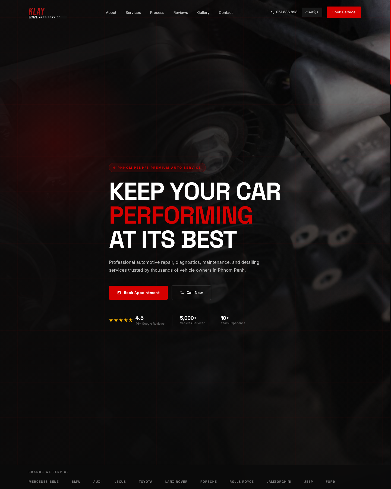

# KLAY Auto Service

Premium auto repair and maintenance website for KLAY Auto Service in Phnom Penh, Cambodia.



## Overview

KLAY Auto Service is a responsive landing page for an automotive workshop. The site is designed with a dark premium look, red brand accents, strong service-focused sections, and clear calls to action for booking a service or calling the workshop.

## Features

- Responsive one-page website layout
- Hero section with appointment and call buttons
- English and Khmer language toggle
- Service cards for diagnostics, maintenance, brakes, AC, detailing, and electrical repair
- Brand section for supported vehicle brands
- Process, reviews, gallery, and contact sections
- Mobile navigation menu
- Scroll reveal animations

## Built With

- HTML5
- CSS3
- JavaScript
- SVG brand assets
- Vercel for deployment

## Project Structure

```text
.
├── assets/
│   ├── brands/
│   └── screenshot.png
├── index.html
└── README.md
```

## Run Locally

Open `index.html` in a browser, or serve the folder with a simple local server:

```bash
npx serve .
```

## Author

Built by Kimlang while practicing frontend development and modern responsive website design.
